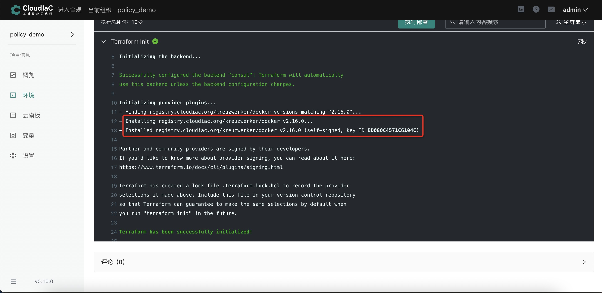

# 使用registry的provider

## 准备工作

### 创建云模板

步骤参考[创建云模板](../quick-start/create-template.md)

本步骤创建云模板所使用的示例仓库：[https://github.com/cong2960/use-registry-provider-demo](https://github.com/cong2960/use-registry-provider-demo)，您可自行fork用于测试

以使用docker为例：

要使用本地发布到registry中的provider，只需要把tf文件中对应provider的参数source以及version的值改为对应的registry存在的provider地址和版本即可，registry具体有哪些provider可查看[https://registry.cloudiac.org/provider](https://registry.cloudiac.org/provider)

示例仓库中main.tf中的文件内容如下：

**注意：创建云模板时请fork示例仓库或自行创建仓库进行测试**

### 创建环境

参考[创建环境](../quick-start/deploy-env.md)

**注意：创建环境时请使用上述步骤创建出的云模板**

### 效果展示

由此可见使用的正是registry中的provider而非terraform官方的provider